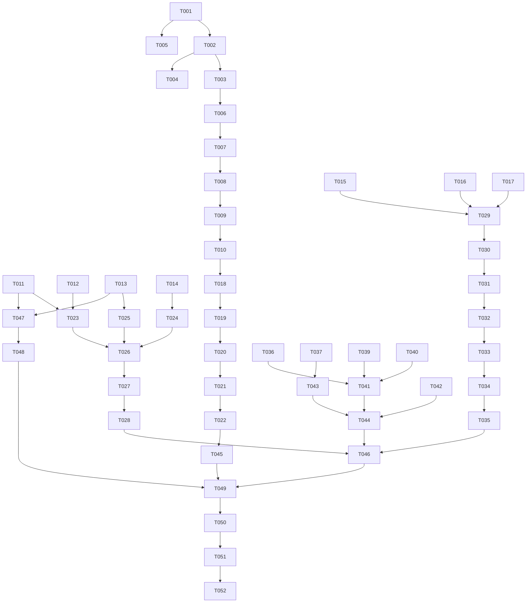

# Tasks: 项目全面完善

**Input**: Design documents from `spec/project-enhance/`
**Prerequisites**: plan.md (required), spec.md (required for user stories)

**Tests**: Not explicitly requested in the feature specification.

**Organization**: Tasks are grouped by user story to enable independent implementation and testing of each story.

## Format: `[ID] [P?] [Story] Description`

- **[P]**: Can run in parallel (different files, no dependencies)
- **[Story]**: Which user story this task belongs to (e.g., US1, US2, US3, US4)
- Include exact file paths in descriptions

## Phase 1: Setup (Shared Infrastructure)

**Purpose**: 创建共享接口定义和基础结构，为所有用户故事提供依赖基础

- [X] T001 在 hsp_core 新增 IRecipeRepository 接口定义文件 `hsp-core/src/main/ets/model/IRecipeRepository.ets`，包含 init、queryApprovedRecipes、getRecipe、hasBookmarked 方法签名
- [X] T002 更新 hsp_core 导出，在 `hsp-core/src/main/ets/Index.ets` 中新增导出 IRecipeRepository
- [X] T003 [P] 确认 feature-community RecipeRepository 实现了 IRecipeRepository 接口，在 `feature-community/src/main/ets/repository/RecipeRepository.ets` 中添加 implements IRecipeRepository
- [X] T004 [P] 更新 feature-community 导出，在 `feature-community/src/main/ets/Index.ets` 中确保导出 RecipeRepository 和 RecipeUpdate
- [X] T005 [P] 添加 MindSpore Lite syscap 声明，在 `hsp-llm/src/main/resources/base/profile/syscap.json` 中添加 SystemCapability.AI.MindSporeLite

---

## Phase 2: Foundational (Blocking Prerequisites)

**Purpose**: 核心基础设施修改，必须在所有用户故事之前完成

**⚠️ CRITICAL**: No user story work can begin until this phase is complete

- [X] T006 删除 hsp-service 中的重复 RecipeRepository 文件 `hsp-service/src/main/ets/repository/RecipeRepository.ets`
- [X] T007 更新 hsp-service 导出，在 `hsp-service/src/main/ets/Index.ets` 中移除 RecipeRepository 的 re-export
- [X] T008 修改 AiRecipeRecommenderService，删除 `hsp-service/src/main/ets/service/AiRecipeRecommenderService.ets` 中的 stub interface RecipeRepository，改为导入 hsp_core 的 IRecipeRepository，将 recipeRepo 类型改为 IRecipeRepository | null
- [X] T009 更新 ServiceManager，在 `entry/src/main/ets/ServiceManager.ets` 中取消注释 setRecipeRepo 调用（line 162），将 import 改为从 hsp_core 导入 IRecipeRepository
- [X] T010 验证 ServiceManager.initAiServices 中 recipeRepo 参数类型兼容性，确保 AppState 传入的 feature-community RecipeRepository 满足 IRecipeRepository 接口约束 `entry/src/main/ets/ServiceManager.ets`
- [X] T011 [P] 修改 OnDeviceLlmBridge.tryNpuInference，替换空壳为 MindSpore Lite 推理调用逻辑 `hsp-llm/src/main/ets/bridge/OnDeviceLlmBridge.ets`
- [X] T012 [P] 修改 OnDeviceLlmBridge.detectNpuAvailability，替换假硬件检测为 canIUse('SystemCapability.AI.MindSporeLite') 调用 `hsp-llm/src/main/ets/bridge/OnDeviceLlmBridge.ets`
- [X] T013 [P] 修改 ModelManager.loadModel，替换假模型加载为 mindSporeLite.loadModelFromFile 调用，支持 CPU/NPU context 配置 `hsp-llm/src/main/ets/ModelManager.ets`
- [X] T014 [P] 在 OnDeviceLlmBridge 中新增 MindSpore Lite 模型会话管理属性（msModel、modelLoaded），确保模型只加载一次并复用 `hsp-llm/src/main/ets/bridge/OnDeviceLlmBridge.ets`
- [X] T015 [P] 充实 ProfileViewModel，添加用户资料、营养摘要、扫描历史等数据属性和 loadProfile/refreshNutritionSummary 方法 `feature-profile/src/main/ets/viewmodel/ProfileViewModel.ets`
- [X] T016 [P] 充实 NutritionTrendViewModel，添加营养趋势数据属性和加载方法 `feature-profile/src/main/ets/viewmodel/NutritionTrendViewModel.ets`
- [X] T017 [P] 充实 ScanHistoryViewModel，添加扫描历史数据属性和加载方法 `feature-profile/src/main/ets/viewmodel/ScanHistoryViewModel.ets`

**Checkpoint**: Foundation ready - IRecipeRepository接口就位、MindSpore Lite集成框架就绪、ViewModel充实完成

---

## Phase 3: User Story 1 - AI食谱推荐完整可用 (Priority: P1) 🎯 MVP

**Goal**: 修复RecipeRepository跨模块类型冲突，恢复AI食谱推荐链路

**Independent Test**: 调用AI食谱推荐接口验证返回结果非空

### Implementation for User Story 1

- [X] T018 [US1] 清理 hsp-service 中所有对旧 RecipeRepository 的剩余引用，搜索 hsp-service 模块内所有文件确保无断链 `hsp-service/src/main/ets/`
- [X] T019 [US1] 修复 RepositoryManager 中的 RecipeRepository 导入，从 feature_community 改为 hsp_core 的 IRecipeRepository 或直接引用 feature-community 的实现 `entry/src/main/ets/RepositoryManager.ets`
- [X] T020 [US1] 删除 entry 中的冗余 RecipeRepository re-export 文件 `entry/src/main/ets/repository/RecipeRepository.ets`
- [X] T021 [US1] 验证 AppState.initRepositories 中 recipeRepo 初始化和传递链路完整：AppState → ServiceManager.initAiServices → AiRecipeRecommenderService.setRecipeRepo `entry/src/main/ets/AppState.ets`
- [X] T022 [US1] 端到端验证 AI 食谱推荐链路，确认 AiRecipeRecommenderService.fetchCandidateRecipes 能通过 recipeRepo 查询到食谱数据 `hsp-service/src/main/ets/service/AiRecipeRecommenderService.ets`

**Checkpoint**: AI食谱推荐功能恢复，setRecipeRepo调用成功，推荐链路完整

---

## Phase 4: User Story 2 - 端侧AI推理真实可用 (Priority: P2)

**Goal**: 集成MindSpore Lite实现端侧推理，替换空壳NPU推理和假硬件检测

**Independent Test**: 飞行模式下扫描食品，验证AI分析结果来源标识

### Implementation for User Story 2

- [X] T023 [US2] 实现 OnDeviceLlmBridge 的 MindSpore Lite 推理主流程：加载模型 → 获取输入 Tensor → PromptBuilder输出编码为Float32 → setData → predict → 解码输出Tensor为文本 `hsp-llm/src/main/ets/bridge/OnDeviceLlmBridge.ets`
- [X] T024 [US2] 实现 OnDeviceLlmBridge 的模型生命周期管理：initModel（首次加载）、releaseModel（销毁会话）、isModelReady（状态查询） `hsp-llm/src/main/ets/bridge/OnDeviceLlmBridge.ets`
- [X] T025 [US2] 完善 ModelManager 的模型路径管理：从 ModelDownloadService 获取模型文件路径，支持 CPU context（target:['cpu']）和 NPU context（target:['npu']）配置 `hsp-llm/src/main/ets/ModelManager.ets`
- [X] T026 [US2] 增强 OnDeviceLlmBridge.infer 的降级链路：MindSpore Lite推理失败时 catch 异常 → ruleBasedInference → LlmFallbackStrategy，确保每个降级步骤都有日志和 source 标识 `hsp-llm/src/main/ets/bridge/OnDeviceLlmBridge.ets`
- [X] T027 [US2] 更新 hsp-llm 导出，确保新增的公共方法可通过 Index.ets 访问 `hsp-llm/src/main/ets/Index.ets`
- [X] T028 [US2] 验证端侧推理在模拟器（CPU模式）上的基本可用性，确认降级链路在无NPU环境下正常工作 `hsp-llm/src/main/ets/bridge/OnDeviceLlmBridge.ets`

**Checkpoint**: 端侧推理链路完整，MindSpore Lite集成可用，降级逻辑正常

---

## Phase 5: User Story 3 - 个人中心完整体验 (Priority: P3)

**Goal**: 实现ProfilePage和真实ViewModel，完善个人中心UI

**Independent Test**: 切换到"我的"Tab验证页面渲染完整性

### Implementation for User Story 3

- [X] T029 [P] [US3] 创建 ProfilePage 页面组件，包含用户信息区（头像+昵称+编辑入口）、家庭成员快捷卡片、本周营养评分摘要卡片（本周评分+卡路里/钠/糖均值）、最近扫描记录列表（最多5条）、功能快捷入口网格（营养趋势/扫描历史/过敏配置/家庭成员/购物清单/设置） `feature-profile/src/main/ets/pages/ProfilePage.ets`
- [X] T030 [US3] 更新 feature-profile 导出，在 Index.ets 中新增导出 ProfilePage 和 AllergySetupWizard `feature-profile/src/main/ets/Index.ets`
- [X] T031 [US3] 修改 MainTabsPage 第4个Tab内容，将 SettingsPage 替换为 ProfilePage，SettingsPage 改为从 ProfilePage 导航进入的子页面 `entry/src/main/ets/pages/MainTabsPage.ets`
- [X] T032 [US3] 在 MainTabsPage 的 buildNavDestination 中注册 SettingsPage 导航目标（如未注册） `entry/src/main/ets/pages/MainTabsPage.ets`
- [X] T033 [US3] 实现 ProfilePage 中各快捷入口的导航跳转逻辑：营养趋势→NutritionTrendPage、扫描历史→ScanHistoryTimelinePage、过敏配置→AllergenSetupWizard、家庭成员→MemberPage、购物清单→ShoppingListPage、设置→SettingsPage `feature-profile/src/main/ets/pages/ProfilePage.ets`
- [X] T034 [US3] 更新 main_pages.json 注册 ProfilePage 路由（如 feature-profile 页面需要在 entry 的路由表中注册） `entry/src/main/resources/base/profile/main_pages.json`
- [X] T035 [US3] 验证 ProfileViewModel 与 ProfilePage 的数据绑定正确，确保页面加载时 ViewModel.loadProfile 被调用并驱动UI渲染 `feature-profile/src/main/ets/viewmodel/ProfileViewModel.ets`

**Checkpoint**: 个人中心页面完整，"我的"Tab显示ProfilePage，各入口可点击跳转

---

## Phase 6: User Story 4 - 清理死代码和占位页 (Priority: P4)

**Goal**: 删除未引用的占位页面、死代码组件和冗余re-export

**Independent Test**: 全局搜索确认被删文件无引用，构建无@Entry export警告减少

### Implementation for User Story 4

- [X] T036 [P] [US4] 删除 ScanPlaceholderPage 文件 `feature-scan/src/main/ets/pages/ScanPlaceholderPage.ets`
- [X] T037 [P] [US4] 删除 CommunityPlaceholderPage 文件 `feature-community/src/main/ets/pages/CommunityPlaceholderPage.ets`
- [X] T038 [P] [US4] 删除 ServicePlaceholderPage 文件 `hsp-service/src/main/ets/pages/ServicePlaceholderPage.ets`
- [X] T039 [P] [US4] 删除 HarmonyOS61Components 文件 `entry/src/main/ets/components/HarmonyOS61Components.ets`
- [X] T040 [P] [US4] 删除 Advanced3DComponents 文件 `entry/src/main/ets/components/Advanced3DComponents.ets`
- [X] T041 [US4] 清理 main_pages.json 中已删除占位页的路由条目 `entry/src/main/resources/base/profile/main_pages.json`
- [X] T042 [US4] 清理 feature-scan/main_pages.json 中 ScanPlaceholderPage 的路由条目（如存在） `feature-scan/src/main/resources/base/profile/main_pages.json`
- [X] T043 [US4] 清理 feature-community/main_pages.json 中 CommunityPlaceholderPage 的路由条目（如存在） `feature-community/src/main/resources/base/profile/main_pages.json`
- [X] T044 [US4] 全局搜索验证：确认 ScanPlaceholderPage、CommunityPlaceholderPage、ServicePlaceholderPage、HarmonyOS61Components、Advanced3DComponents 在全项目中无任何 import 或字符串引用

**Checkpoint**: 死代码清理完成，项目无未引用文件

---

## Phase 7: Polish & Cross-Cutting Concerns

**Purpose**: 跨用户故事的改进和最终验证

- [X] T045 [P] 验证 RecipeUpdate 类型统一：确认 hsp-service 中所有使用 RecipeUpdate 的地方已改为从 feature-community 导入或使用 IRecipeRepository 接口，无残留的类型冲突 `hsp-service/src/main/ets/`
- [X] T046 [P] 验证所有修改文件的 ArkTS 语法合规性（无 as unsafe 类型断言、无 dynamic type、interface 正确声明） `所有修改的 .ets 文件`
- [X] T047 确认 MindSpore Lite import 路径正确：使用 `import { mindSporeLite } from '@kit.MindSporeLiteKit'` 而非旧版 `@ohos.ai.mindSporeLite` `hsp-llm/src/main/ets/bridge/OnDeviceLlmBridge.ets` 和 `hsp-llm/src/main/ets/ModelManager.ets`
- [X] T048 检查 oh-package.json5 中 hsp-llm 模块是否需要添加 MindSporeLiteKit 依赖声明 `hsp-llm/oh-package.json5`
- [ ] T049 验证构建无新增编译错误，@Entry export 警告减少至少3个（3个占位页已删除）

---

## Phase 8: Verification

<!-- verification_scope: build+ui -->

**Purpose**: Build, deploy, and UI-verify the implemented feature

- [ ] T050 Build project and fix any compilation errors (invoke build_project; iterate fix → build until success)
- [ ] T051 Deploy application to device/emulator (invoke start_app)
- [ ] T052 Run UI verification against deployed application (invoke verify_ui)

---

## 📊 Dependency Graph



## ⚡ Parallel Execution Guide

| Phase | Tasks | Required Files | Execution Notes |
|-------|-------|---------------|-----------------|
| Setup | T003, T004, T005 | feature-community, hsp-llm | 可并行：不同文件无依赖 |
| Foundational | T011, T012 + T013, T014 | hsp-llm (OnDeviceLlmBridge, ModelManager) | MindSpore Lite相关任务可并行与RecipeRepository任务 |
| Foundational | T015, T016, T017 | feature-profile (ViewModels) | 3个ViewModel充实可并行 |
| US1 | - | entry, hsp-service | 串行执行，有依赖链 |
| US2 | T023→T026 | hsp-llm | 串行推理链路实现 |
| US3 | T029 (可与其他Story并行) | feature-profile, entry | ProfilePage创建可独立进行 |
| US4 | T036-T040 | 多模块文件删除 | 全部可并行删除 |
| Polish | T045, T046, T047, T048 | 多文件 | 大部分可并行验证 |

## Implementation Strategy

### MVP First (User Story 1 Only)

1. Complete Phase 1: Setup → IRecipeRepository接口就位
2. Complete Phase 2: Foundational → RecipeRepository统一、MindSpore框架就绪、ViewModel充实
3. Complete Phase 3: User Story 1 → AI食谱推荐恢复
4. **STOP and VALIDATE**: 验证推荐接口返回非空

### Incremental Delivery

1. Setup + Foundational → 基础就绪
2. US1 → AI推荐恢复 → 验证
3. US2 → 端侧推理可用 → 验证
4. US3 → 个人中心完整 → 验证
5. US4 → 死代码清理 → 验证
6. Polish → 最终质量检查
7. Verification → 构建部署UI验证

## Path Conventions

- **多模块项目**: 文件路径使用模块相对路径标注，如 `hsp-core/src/main/ets/model/IRecipeRepository.ets`
- **绝对路径基准**: `E:\APP\family_food_app\`
- 所有 `entry/` 路径指 `E:\APP\family_food_app\entry/`
- 所有 `hsp-core/` 路径指 `E:\APP\family_food_app\hsp_core/`（注意目录名有下划线）
- 所有 `hsp-service/` 路径指 `E:\APP\family_food_app\hsp-service/`
- 所有 `hsp-llm/` 路径指 `E:\APP\family_food_app\hsp-llm/`
- 所有 `feature-community/` 路径指 `E:\APP\family_food_app\feature-community/`
- 所有 `feature-profile/` 路径指 `E:\APP\family_food_app\feature-profile/`
- 所有 `feature-scan/` 路径指 `E:\APP\family_food_app\feature-scan/`

## Dependencies & Execution Order

### Phase Dependencies

- **Setup (Phase 1)**: No dependencies - can start immediately
- **Foundational (Phase 2)**: Depends on Setup completion - BLOCKS all user stories
- **User Stories (Phase 3-6)**: All depend on Foundational phase completion
  - US1 (P1): Must complete first as it fixes core RecipeRepository type system
  - US2 (P2): Can start after Foundational, independent of US1
  - US3 (P3): Can start after Foundational, independent of US1/US2
  - US4 (P4): Can start after Foundational, independent of US1/US2/US3
- **Polish (Phase 7)**: Depends on all user stories being complete
- **Verification (Phase 8)**: Depends on Polish completion

### User Story Dependencies

- **US1 (P1)**: Depends on T001-T010 (Foundational RecipeRepository统一). No dependency on other stories.
- **US2 (P2)**: Depends on T011-T014 (Foundational MindSpore Lite框架). No dependency on other stories.
- **US3 (P3)**: Depends on T015-T017 (Foundational ViewModel充实). No dependency on other stories.
- **US4 (P4)**: No Foundational dependency beyond T001. Can start after Setup.

### Within Each User Story

- Models/interfaces before services
- Services before UI/pages
- Core implementation before integration
- Story complete before moving to next priority

### Parallel Opportunities

- T003, T004, T005 can run in parallel (different modules)
- T006-T010 is sequential (hsp-service deletion chain)
- T011-T014 can run in parallel with T006-T010 (different modules)
- T015-T017 can run in parallel with each other and with T006-T014
- T036-T040 can all run in parallel (file deletions)
- T045-T048 can mostly run in parallel

## Parallel Example: Phase 2 Foundational

```text
# Parallel Group A (RecipeRepository统一):
T006 → T007 → T008 → T009 → T010  (sequential, same module hsp-service)

# Parallel Group B (MindSpore Lite框架):
T011, T012, T013, T014  (can overlap, same files but different methods)

# Parallel Group C (ViewModel充实):
T015, T016, T017  (parallel, different ViewModel files)

# Groups A, B, C can all run in parallel with each other
```

## Notes

- [P] tasks = different files, no dependencies
- [Story] label maps task to specific user story for traceability
- Each user story should be independently completable and testable
- T020 (删除entry RecipeRepository re-export) 同时属于 US1 和 US4，归入 US1 因为它是统一链路的一部分
- MindSpore Lite 在模拟器上可能仅支持 CPU 推理，NPU 推理需真机验证
- ViewModel 充实需要依赖 hsp_service 的服务接口，确保 feature-profile 的 oh-package.json5 已声明 hsp_service 依赖
